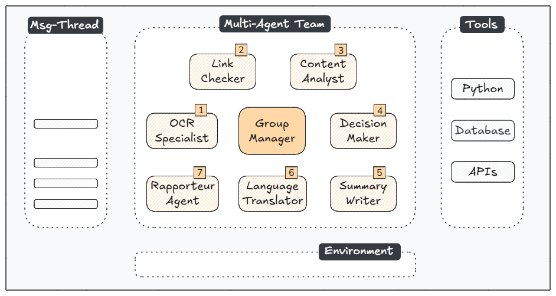
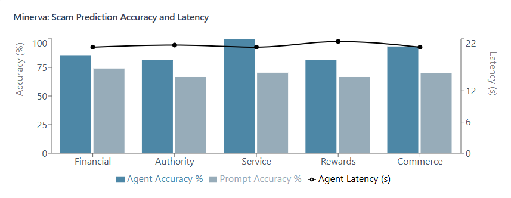
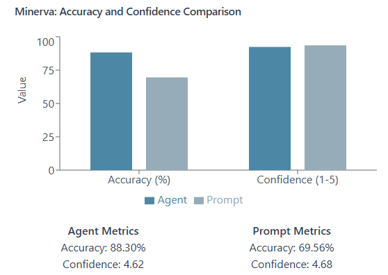

<!-- 
---
title: minerva
emoji: 🔬
colorFrom: blue
colorTo: indigo
sdk: gradio
sdk_version: 5.9.0
app_file: app.py
pinned: false
---
-->

## MINERVA: A Multi-Agent LLM System for Digital Scam Protection

Digital scams inflict devastating impacts in our society. According to the FBI IC3, $37.4 billion was lost in the United States alone over the past five years due to Internet scams [1]. Beyond these direct financial losses, the hidden costs of processing nearly 4 million associated complaints has overwhelmed institutional and enterprise resources [1]. Victims also face lasting psychological disruptions and diminished trust in emerging technologies.

To address this challenge, we present MINERVA, a multi-agent system powered by a Large Language Model (gpt-4o-mini) for protecting users from digital scams. Our system implements a cooperative team of seven specialized agents built on the AutoGen framework (v0.4.0) [2]. Each agent combines advanced model capabilities with specific tools to handle distinct aspects of scam detection: optical character recognition, link verification, content analysis, decision making, summarization, linguistic translation, and archiving. The workflow begins when a user submits a multimodal message and concludes either when agents complete a round-robin conversation cycle or when an agent triggers a termination signal.

To evaluate our system's performance, we developed a hierarchical scam taxonomy, which served as the foundation for creating a diverse synthetic dataset using Claude 3.5 Sonnet. Initial evaluations comparing our multi-agent system against a prompt baseline show that this agentic approach achieves higher accuracy (88.3% vs. 69.5%) and provides further user functionality. This category-level evaluation approach further revealed that the model tends to adopt a more conservative stance in certain scam types.

Beyond more accurate scam protection, this project aims to enhance digital literacy by providing users with well-reasoned explanations of detected scams, fostering trust in AI-powered safety tools. Additionally, the archiving task of this agentic workflow enables to create an open, anonymized dataset. This scam dataset would serve two purposes: (i) enabling fine-tuning of models with current scam patterns, and (ii) providing insights for law enforcement and cybersecurity professionals to understand emerging threats and attack vectors.

*[This work was developed for RDI Berkeley, LLM-Agents Course, CS294/194-196. By Diego Carpintero]*

### Introduction

We define an *Agent* as a system that leverages a language model to interpret natural language instructions, perform tasks, interact with its environment, and coopearate with other agents (and a human) towards reaching out a given goal.

Recent advancements in AI have enabled the development of sophisticated agents capable of reasoning and tool usage, with multi-agent collaboration emerging as a promising paradigm for complex tasks. Our intuition is that scam detection represents an ideal application domain for such multi-agent systems due to its inherent complexity and need for diverse analytical perspectives. Digital scams typically combine multiple deceptive elements — from social engineering tactics to technical manipulation — requiring different types of analysis. A multi-agent approach allows specialized agents to focus on distinct aspects while cooperating through structured dialogue to form comprehensive assessments.

### Architecture

<p align="center">
  
</p>
<p align="center">Minerva: Multi-Agent LLM System Architecture</p>

Our architecture consists of seven specialized agents coordinated by a group manager that orchestrates interactions in a round-robin fashion. Operating on a publish-subscribe pattern, agents share a common message thread where they publish their findings - from OCR analysis and link verification to content examination, decision making, summarization, linguistic translation, and archiving. The system processes multimodal messages using Python methods, APIs, and database tools. The system processes each multimodal message using Python methods, APIs, and database tools, with users submitting the input as a screenshot of a digital communications.

### Agents

Our specialized agents are built on AutoGen v0.4.0:

- `OCR Agent`: *Extracts text from an image using pytesseract or the LLM-Vision capabilities.*
- `Link Checker`: *Verifies the legitimacy of URLs using Google SafeBrowsing API.*
- `Content Analyst`: *Analyzes the extracted text for scam patterns.*
- `Decision Maker`: *Synthesizes the analyses and makes final determination.*
- `Summarizer`: *Generates a summary of the final determination.*
- `Language Translation Specialist`: *Translates the summary to the user language.*
- `Data Storage Agent`: *Store the extracted text, assessment summary, determination (1, 0) and confidence level [1-5] in a sqlite database*

 with system prompts defined in [./config/agents.yaml](./config/agents.yaml).

In this example, we show how to create the `Link Checker`, `Language Translation` and `Data Storage` Agents:

```
link_checker_agent:
  assignment: >
    You are an Internet link checker. Your role is to:
      1. Check the extracted text for any URLs
      2. Verify the legitimacy of the URLs using your registered function

language_translation_agent:
  assignment: >
    You are a language translation specialist. Your role is to:
      1. Infer the languge of the text extracted from the image, this is the user language
      2. If the user language is different than english, translate your summary into the user language

data_storage_agent:
  assignment: >
    You are a data storage specialist. 
    Your role is to store using the registered function the following fields:
        - extracted text
        - summary
        - final determination ('1' for scam, '0' for not_scam)
        - confidence level on your final determination in a scale from 1-5 [...]
      All the fields are mandatory
```

```python
agents = []

agents.append(ToolUseAssistantAgent(
    name="Link_Checker",
    description="Checks if a Link is safe",
    system_message=self.config['link_checker_agent']['assignment'],
    model_client=self.model,
    registered_tools=[url_checker_tool]
))

agents.append(ToolUseAssistantAgent(
    name="DataStorage_Agent",
    description="Store the extracted text, summary, determination (1, 0) and confidence level (high, medium low) in a database",
    system_message=self.config['data_storage_agent']['assignment'],
    model_client=self.model,
    registered_tools=[db_connector_tool]
))

agents.append(AssistantAgent(
    name="Language_Translation_Agent",
    description="Translate the summary to the user language",
    system_message=self.config['language_translation_agent']['assignment'],
    model_client=self.model
))
```
Note that `Link Checker` and `Data Storage` are defined as `ToolUseAssistantAgent` as they have access to the tools set in the `registed_tools` parameter, whereas `Language Translation` is an `AssitantAgent` relying on the LLM capabilities to carry out its task.

### Tools

We have decoupled the implementation of our tools into a specific `./tools` module:

- `db_connector.py`: Manages storing and retrieval of analysis results into a `SQLite` database.
- `image_ocr.py`: Handles OCR (Optical Character Recognition).
- `url_checker.py`: Implements "MALWARE", "SOCIAL_ENGINEERING" "UNWANTED_SOFTWARE", "POTENTIALLY_HARMFUL_APPLICATION" checks for extracted URLs using [Google's SafeBrowsing API](https://developers.google.com/safe-browsing/v4/).
- `formatter.py`: This is a non-agentic tool that formats `TaskResult` and `Response` messages into a string format for streaming the workflow steps into the user interface.

### Orchestration

Our agentic team is created as a `RoundRobinGroupChat`:

```python
def create_team(self) -> RoundRobinGroupChat:
  """Create a team of agents that work together in Round Robin fashion"""
  termination = TextMentionTermination("NO_TEXT_FOUND")

  return RoundRobinGroupChat(
    self.agents,
    max_turns=7,
    termination_condition=termination
  )
    
async def reset(self):
  """Reset team state"""
  await self.team.reset()
```

This defines the following workflow:
- agents cooperate in a round-robin sequence, with each agent performing its specialized task
- the workflow terminates either when all agents complete their tasks or when the OCR specialist cannot extract text from the provided image
- the team state resets after each cycle to ensure independence between detection tasks

### Application

MINERVA scam detection system can be tested through a web interface at https://huggingface.co/spaces/dcarpintero/minerva. This demo supports messages in multiple languages and includes prepared examples for evaluation:

<p align="center">
  
</p>
<p align="center">Minerva: Analysis with Multi-Lingual Messages</p>

### Evaluation

#### Dataset Creation

Our evaluation methodology is based on a synthetic dataset developed in two phases. First, we prompted Claude 3.5 Sonnet to generate a hierarchical taxonomy of scam categories, informed by academic research provided in context. The taxonomy comprises five main categories: financial, commerce, authority impersonation, rewards and opportunities, and customer service deception. Using this framework, we generated a balanced dataset with two deceptive messages and one legitimate (control) message for each subcategory.

#### Results

Our initial evaluation compared MINERVA against a prompt baseline (temperature=0.0, seed=42) using the same model version (gpt-4o-mini). Results show that our multi-agent approach achieves higher accuracy (88.3% vs. 69.5%) while requiring additional processing time (20.7 vs. 0.5 seconds). Agentic performance varies across categories, with particularly strong accuracy in service-related scam (~100%) and commerce (~93%). A category-level analysis further revealed that while both approaches reflect similar confidence levels (4.62 vs. 4.68 on a 1-5 scale) on all categories, our system's missed predictions primarily occur in the control group of specific categories. This might suggest that the model tends to express a more defensive assessment in certain topics such as opportunity/rewards and authority impersonation.

<p align="center">
  
</p>

<p align="center">
  
</p>

### Societal Benefits

Beyond more accurate scam protection, this project aims to enhance digital literacy by providing users with well-reasoned explanations of detected scams, fostering trust in AI-powered safety tools. Additionally, the archiving task of this agentic workflow enables to create an open, anonymized dataset. This scam dataset would serve, at least, two purposes: (i) enabling fine-tuning of models with current scam patterns, and (ii) providing insights for law enforcement and cybersecurity professionals to understand emerging threats and attack vectors.

### References

- [1] [FBI's Internet Crime Complaint Center (IC3), 2023 Internet Crime Report](https://www.ic3.gov/AnnualReport/Reports/2023_IC3Report.pdf)
- [2] [AutoGen: Enabling Next-Gen LLM Applications via Multi-Agent Conversation](https://arxiv.org/abs/2308.08155)

### Author

Diego Carpintero (https://github.com/dcarpintero)
