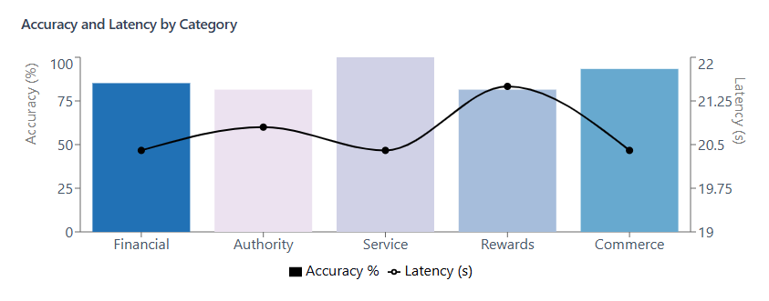
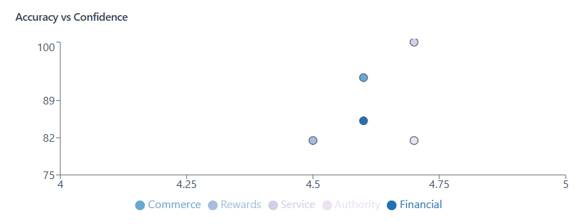

<!-- 
---
title: minerva
emoji: 🔬
colorFrom: blue
colorTo: indigo
sdk: gradio
sdk_version: 5.9.0
app_file: app.py
pinned: false
---
-->

## MINERVA: A Multi-Agent LLM System for Digital Scam Protection

Digital scams inflict devastating impacts in our society. According to the FBI IC3, $37.4 billion was lost in the United States alone over the past five years due to Internet scams [1]. Beyond these direct losses, the hidden costs of processing nearly 4 million associated complaints [1] has overwhelmed institutional and enterprise resources, while victims face psychological disruptions and eroding trust in novel technologies.

To address this challenge, we explore the use of a multi-agent system based on a Large Language Model (gpt-4o-mini) to protect users from digital scams. MINERVA implements a cooperative team of seven specialized agents using the AutoGen framework (v0.4.0) [2]. Each agent combines advanced model capabilities and tools to focus on a specific aspect of scam detection: optical character recognition, link verification, content analysis, decision making, summarization, linguistic translation, and archiving. The workflow is initiated by a user sending a multimodal message to the group manager. It ends when all agents complete a round-robin conversation cycle or when an agent triggers a termination signal. Following this autonomous workflow, the user receives clear, actionable guidance in their own language.

Beyond immediate protection, this project aims to improve digital literacy by providing users with detailed explanations of detected scams, fostering trust in AI-powered safety tools. Additionally, archiving the results enables the creation of an open, anonymized dataset of reported scams. This dataset would serve two purposes: (i) enabling fine-tuning of future models with current scam patterns, and (ii) providing insights for law enforcement and cybersecurity professionals to understand emerging threats and attack vectors.

*[This work was developed for RDI Berkeley, LLM-Agents Course, CS294/194-196. By Diego Carpintero]*

### Introduction

We define an *Agent* as a system that leverages a language model to interpret natural language instructions, perform tasks, interact with its environment and coopearate with other agents (and a human) towards reaching out a defined goal.

Recent advancements in AI have enabled the development of sophisticated agents capable of reasoning and tool usage, with multi-agent collaboration emerging as a promising paradigm for complex tasks. Our intuition is that scam detection represents a promising research area for such multi-agent systems due to its inherent complexity and the need for diverse analytical perspectives. Digital scams often combine multiple deceptive elements - from social engineering tactics to technical manipulation - requiring different types of analysis. A multi-agent approach enables a group of specialized agents to focus on distinct aspects while cooperating through structured dialogue to form a comprehensive assessment.

### Architecture

<p align="center">
  
</p>
<p align="center">Minerva: Multi-Agent LLM System Architecture</p>

Our architecture comprises seven specialized agents coordinated by a group manager who selects the next speaker in a round-robin fashion. Operating on a publish-subscribe pattern, all agents share a common message thread where they publish their findings - from OCR analysis and link verification to content examination, decision making, and language translation. The system processes multimodal messages using Python methods, APIs, and database tools. The environment is represented by multi modal messages (in practice, screenshots of a digital communication) provided by users.

### Agents

The system implements specialized agents with system prompts defined in [./config/agents.yaml](./config/agents.yaml):

- `OCR Agent`: *Extracts text from an image using pytesseract or the LLM-Vision capabilities.*
- `Link Checker`: *Verifies the legitimacy of URLs using Google SafeBrowsing API.*
- `Content Analyst`: *Analyzes the extracted text for scam patterns.*
- `Decision Maker`: *Synthesizes the analyses and makes final determination.*
- `Summarizer`: *Generates a summary of the final determination.*
- `Language Translation Specialist`: *Translates the summary to the user language.*
- `Data Storage Agent`: *Store the extracted text, assessment summary, determination (1, 0) and confidence level [1-5] in a sqlite database*

In this example, we show how to create the `Link Checker`, `Language Translation` and `Data Storage` Agents:

```
link_checker_agent:
  assignment: >
    You are a Link checker. Your role is to:
      1. Check the extracted text for any URLs
      2. Verify the legitimacy of the URLs using your registered function

language_translation_agent:
  assignment: >
    You are a language translation specialist. Your role is to:
      1. Infer the languge of the text extracted from the image, this is the user language
      2. If the user language is different than english, translate your summary into the user language

data_storage_agent:
  assignment: >
    You are a data storage specialist. 
    Your role is to store using the registered function the following fields:
        - extracted text
        - your summary
        - final determination ('1' for scam, '0' for not_scam)
        - confidence level on your final determination in a scale from 1-5, where 5 is highly confident
      All the fields are mandatory
```

```python
agents = []

agents.append(ToolUseAssistantAgent(
    name="Link_Checker",
    description="Checks if a Link is safe",
    system_message=self.config['link_checker_agent']['assignment'],
    model_client=self.model,
    registered_tools=[url_checker_tool]
))

agents.append(ToolUseAssistantAgent(
    name="DataStorage_Agent",
    description="Store the extracted text, summary, determination (1, 0) and confidence level (high, medium low) in a database",
    system_message=self.config['data_storage_agent']['assignment'],
    model_client=self.model,
    registered_tools=[db_connector_tool]
))

agents.append(AssistantAgent(
    name="Language_Translation_Agent",
    description="Translate the summary to the user language",
    system_message=self.config['language_translation_agent']['assignment'],
    model_client=self.model
))
```
Note that `Link Checker` and `Data Storage` are defined as `ToolUseAssistantAgent` as they have access to the tools set in the `registed_tools` field, whereas `Language Translation` is an `AssitantAgent` relying on the LLM capabilities to carry out its task.

### Tools

We have decoupled the implementation of our tools into a specific module `./tools`:

- `db_connector.py`: Manages storing and retrieval of analysis results into a `SQLite` database.
- `image_ocr.py`: Handles OCR (Optical Character Recognition).
- `url_checker.py`: Implements "MALWARE", "SOCIAL_ENGINEERING" "UNWANTED_SOFTWARE", "POTENTIALLY_HARMFUL_APPLICATION" checks for extracted URLs using [Google's SafeBrowsing API](https://developers.google.com/safe-browsing/v4/).
- `formatter.py`: This is a non-agentic tool that formats `TaskResult` and `Response` messages into a string format for streaming the workflow steps into the user interface.

### Orchestration

Our agentic team is created as a `RoundRobinGroupChat`:

```python
def create_team(self) -> RoundRobinGroupChat:
  """Create a team of agents that work together in Round Robin fashion"""
  termination = TextMentionTermination("NO_TEXT_FOUND")

  return RoundRobinGroupChat(
    self.agents,
    max_turns=7,
    termination_condition=termination
  )
    
async def reset(self):
  """Reset team state"""
  await self.team.reset()
```

This define the following workflow:
- cooperation as a team in round-robin fashion
- termination is enabled all agents have completed their tasks, or if no text can be extracted by the OCR specialist in the image provided.
- reset team status after each cycle (as each detection task should be indepedent from the previous analysis).

### App

This scam prediction process can be easily tested at https://huggingface.co/spaces/dcarpintero/minerva. Try out with messages in different languages or use one of the prepared examples:

<p align="center">
  
</p>
<p align="center">Minerva: Analysis with Multi-Lingual Messages</p>

### Evaluation

#### Dataset Creation

Our preliminary analysis was conducted on a synthetic dataset developed through a two-step methodology. First, we prompted Claude 3.5 Sonnet to generate a comprehensive taxonomy of scam categories and subcategories, informed by academic research provided in an in-context fashion. The resulting framework consists of 5 main categories, each with multiple subcategories. Using this taxonomy, we then prompted again the model to generate representative message samples: two deceptive messages and one legitimate (control) message for each subcategory.

#### Results

<p align="center">
  
</p>

<p align="center">
  
</p>

### References

- [1] [FBI's Internet Crime Complaint Center (IC3), 2023 Internet Crime Report](https://www.ic3.gov/AnnualReport/Reports/2023_IC3Report.pdf)
- [2] [AutoGen: Enabling Next-Gen LLM Applications via Multi-Agent Conversation](https://arxiv.org/abs/2308.08155)
