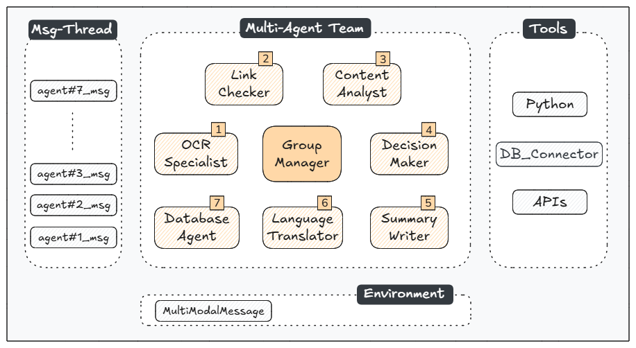

<!-- 
---
title: minerva
emoji: 🔬
colorFrom: blue
colorTo: indigo
sdk: gradio
sdk_version: 5.9.0
app_file: app.py
pinned: false
---
-->

## MINERVA: A Multi-Agent LLM System for Digital Scam Protection

Digital scams inflict devastating impacts in our society. According to the FBI IC3, $37.4 billion was lost in the United States alone over the past five years due to Internet scams [1]. Beyond these direct losses, the hidden costs of processing nearly 4 million associated complaints [1] has overwhelmed institutional and enterprise resources, while victims face psychological disruptions and eroding trust in novel technologies.

To address this challenge, we explore the use of a multi-agent system based on a Large Language Model (GPT-4o) to protect users from digital scams. MINERVA implements a cooperative team of seven specialized agents using the AutoGen framework (v0.4.0) [2]. Each agent combines advanced model capabilities and tools to focus on a specific aspect of scam detection: optical character recognition, link verification, content analysis, decision making, summarization, linguistic translation, and archiving. The workflow is initiated by a user sending a multimodal message to the group manager. It ends when all agents complete a round-robin conversation cycle or when an agent triggers a termination signal. Following this autonomous workflow, the user receives clear, actionable guidance in their own language.

Beyond immediate protection, this project aims to improve digital literacy by providing users with detailed explanations of detected scams, fostering trust in AI-powered safety tools. Additionally, archiving the results enables the creation of an open, anonymized dataset of reported scams. This dataset would serve two purposes: (i) enabling fine-tuning of future models with current scam patterns, and (ii) providing insights for law enforcement and cybersecurity professionals to understand emerging threats and attack vectors.

*[This work was developed as a project submission for RDI Berkeley, LLM-Agents Course, CS294/194-196. By Diego Carpintero]*

### Introduction

We define an *Agent* as a system that leverages a language model to interpret natural language instructions, perform tasks, interact with its environment and coopearate with other agents (and a human) towards reaching out a defined goal.

Recent advancements in AI have enabled the development of sophisticated agents capable of reasoning and tool usage, with multi-agent collaboration emerging as a promising paradigm for complex tasks.

Our intuition is that scam detection represents a promising research area for such multi-agent systems due to its inherent complexity and the need for diverse analytical perspectives. Digital scams often combine multiple deceptive elements - from social engineering tactics to technical manipulation - requiring different types of analysis. A multi-agent approach enables a group of specialized agents to focus on distinct aspects while cooperating through structured dialogue to form a comprehensive assessment.

### Architecture

  

Minerva: Multi-Agent LLM System Architecture

### Agents with Tools

We define the following agents whose roles are specified in [./config/agents.yaml](./config/agents.yaml):

- OCR Agent: *Extracts text from an image using pytesseract or the LLM-Vision capabilities.*
- Link Checker: *Verifies the legitimacy of URLs using Google SafeBrowsing API.*
- Content Analyst: *Analyzes the extracted text for scam patterns.*
- Decision Maker: *Synthesizes the analyses and makes final determination.*
- Summarizer: *Generates a summary of the final determination.*
- Language Translation Specialist: *Translates the summary to the user language.*
- Data Storage Agent: *Store the extracted text, summary, determination (1, 0) and confidence level in a database*

### Orchestration

In [./agents.py](./agents.py) we create the agents and define the following workflow:
- cooperation as a team in RoundRobin fashion
- the user triggers the process with a MultiModal message (image)
- the termination is enabled all agents have completed their tasks, or if no text can be extracted by the OCR specialist in the image provided.

### App

This scam prediction process can be easily tested at https://huggingface.co/spaces/dcarpintero/minerva

### Streaming Workflow

To visualize the flow of messages among the agents we define a formatter in [./formatter.py](./formatter.py) that is integrated into the App.

### Analysis with Multi-Lingual Messages

  

### References

- [1] [FBI's Internet Crime Complaint Center (IC3), 2023 Internet Crime Report](https://www.ic3.gov/AnnualReport/Reports/2023_IC3Report.pdf)
- [2] [AutoGen: Enabling Next-Gen LLM Applications via Multi-Agent Conversation](https://arxiv.org/abs/2308.08155)
